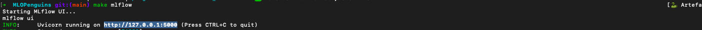
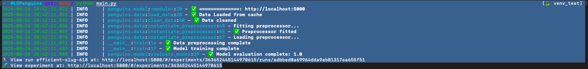
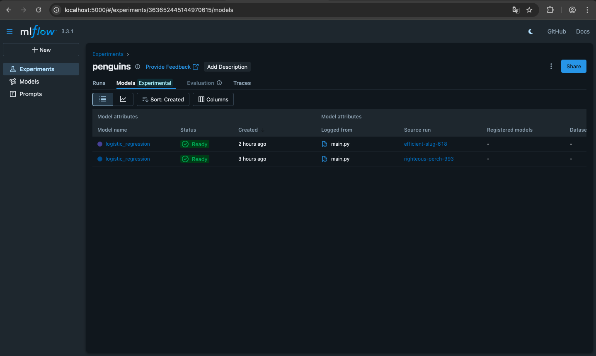

# MlFlow-Tracking-and-Model-Registry

Experiment Tracking and Model Registry with MlFlow

# Usage

How to use this module step by step :

First of all you should add `eval "$(direnv hook bash)"` to your `~/.zshrc` or `~/.bashrc` :

Open first terminal :

```bash
git clone git@github.com:segandiaye/MlFlow-Tracking-and-Model-Registry.git
cd MlFlow-Tracking-and-Model-Registry
make create_env
make install_deps
touch .env .envrc
cp .env.sample .env
cp .envrc.sample .envrc
make allow_direnv
make mlflow
```

The result should look like the image below if everything is OK :



Open second terminal :

```bash
python main.py
```

The result should look like the image below if everything is OK :



Go to http://localhost:5000 you should see as shown in the image below :

